# Documentation Coach Zone - Guide utilisateur complet

## Table des matières

### Parcours Coach

1. [Présentation de l'application](#présentation-de-lapplication)
2. [Inscription et connexion Coach](#inscription-et-connexion-coach)
3. [Navigation dans l'application](#navigation-dans-lapplication)
4. [Recherche d'établissements](#recherche-détablissements)
5. [Filtres de recherche](#filtres-de-recherche)
6. [Consultation des détails d'un établissement](#consultation-des-détails-dun-établissement)
7. [Processus de réservation](#processus-de-réservation)
8. [Gestion des réservations Coach](#gestion-des-réservations-coach)
9. [Gestion des favoris](#gestion-des-favoris)
10. [Profil utilisateur Coach](#profil-utilisateur-coach)

### Parcours Institution

11. [Inscription et connexion Institution](#inscription-et-connexion-institution)
12. [Gestion des réservations Institution](#gestion-des-réservations-institution)
13. [Profil et gestion des prix](#profil-et-gestion-des-prix)

### Fonctionnalités communes

14. [Paramètres de l'application](#paramètres-de-lapplication)
15. [Conseils d'utilisation](#conseils-dutilisation)

---

## Présentation de l'application

**Coach Zone** est une application mobile qui connecte deux types d'utilisateurs :

### Pour les coachs sportifs

-   Rechercher et réserver des espaces sportifs
-   Gérer leurs réservations
-   Sauvegarder leurs établissements favoris
-   Consulter les équipements disponibles

### Pour les institutions sportives

-   Gérer les réservations de leurs espaces
-   Définir les tarifs par créneau horaire
-   Consulter les réservations effectuées par les coachs
-   Suivre l'utilisation de leurs équipements

---

# PARCOURS COACH

## Inscription et connexion Coach

### Première utilisation - Inscription

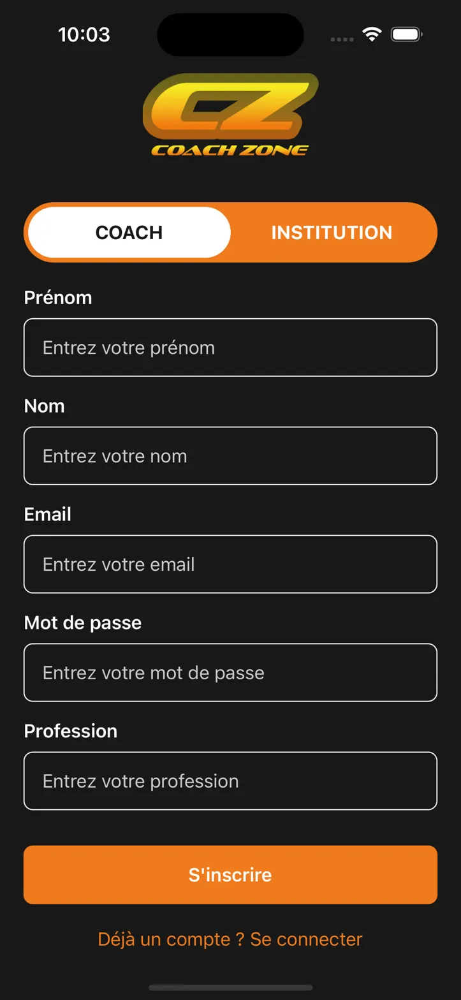

_Écran d'inscription avec sélection du type "COACH"_

Pour créer votre compte coach :

1. **Lancez l'application** Coach Zone
2. **Cliquez sur "Pas encore de compte ? S'inscrire"** depuis l'écran de connexion
3. **Sélectionnez "COACH"** dans le sélecteur de type d'utilisateur (par défaut)
4. **Remplissez le formulaire d'inscription** :
    - **Prénom** : Votre prénom
    - **Nom** : Votre nom de famille
    - **Email** : Votre adresse email professionnelle
    - **Mot de passe** : Choisissez un mot de passe sécurisé
    - **Profession** : Précisez votre spécialité (ex : Personal Trainer)
5. **Cliquez sur "S'inscrire"** pour créer votre compte

### Connexion

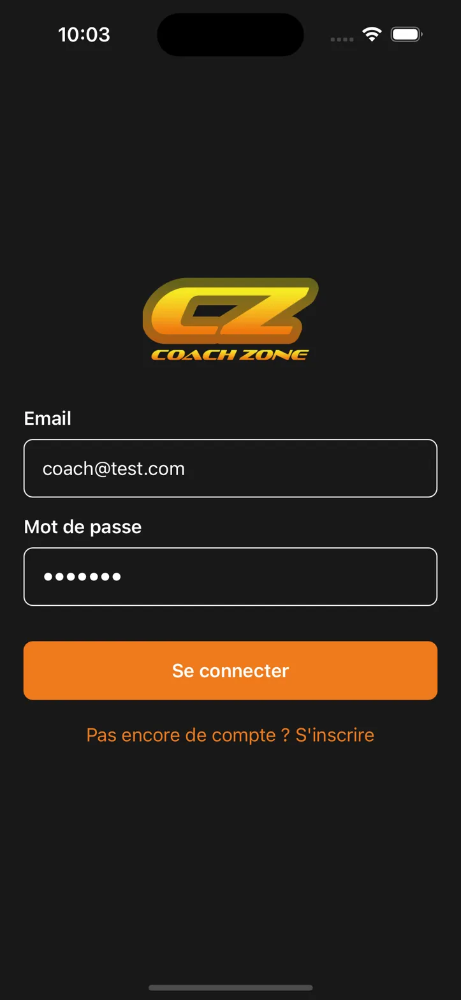

_Écran de connexion avec identifiants_

Si vous avez déjà un compte :

1. **Saisissez votre email** dans le champ "Email"
2. **Saisissez votre mot de passe** (affiché en points pour la sécurité)
3. **Cliquez sur "Se connecter"**

> **💡 Astuce** : Vos identifiants sont sauvegardés pour faciliter les connexions futures.

---

## Navigation dans l'application

L'application dispose d'une **barre de navigation en bas** avec 4 onglets principaux :

| Icône | Section              | Description                              |
| ----- | -------------------- | ---------------------------------------- |
| 🏠    | **Accueil**          | Recherche et découverte d'établissements |
| 📅    | **Mes réservations** | Gestion de vos créneaux réservés         |
| ❤️    | **Mes favoris**      | Établissements sauvegardés               |
| 👤    | **Profil**           | Informations personnelles et paramètres  |

**Éléments de navigation supplémentaires :**

-   **Icône paramètres (⚙️)** : Accessible depuis chaque page en haut à droite
-   **Flèche retour (<)** : Pour revenir à la page précédente

---

## Recherche d'établissements

### Page d'accueil

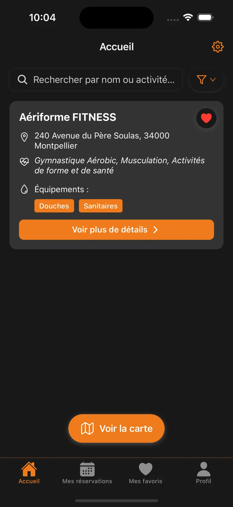

_Page d'accueil avec barre de recherche et carte d'établissement_

La page d'accueil propose deux modes de recherche :

#### 1. Recherche textuelle

-   **Barre de recherche** : "Rechercher par nom ou activité..."
-   **Bouton filtres** : Juste à côté de la barre de recherche pour affiner vos critères
    -   Filtrage par **activités** (Gymnastique Aérobic, Musculation, etc.)
    -   Filtrage par **équipements** (Sanitaires et/ou Douches)
-   Tapez le nom d'un établissement ou d'une activité sportive

#### 2. Recherche géographique

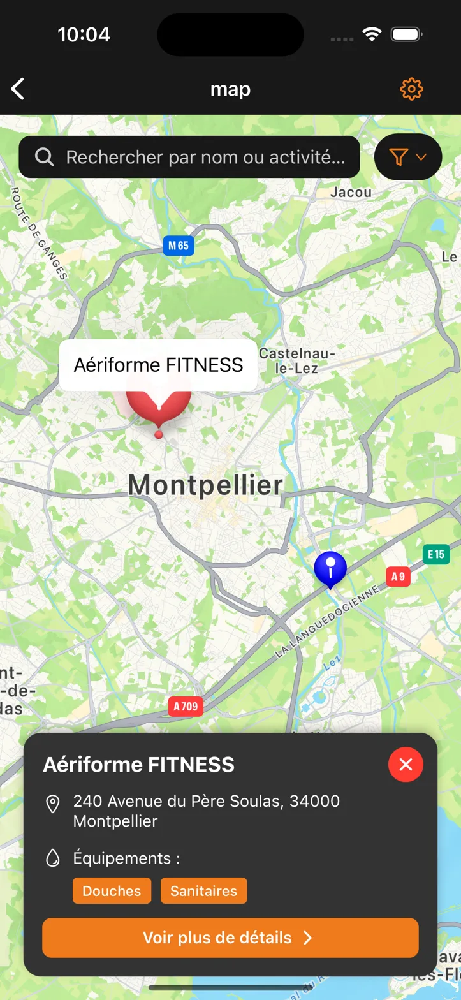

_Carte interactive avec localisation des établissements_

-   **Cliquez sur "Voir la carte"** : Bouton qui affiche les établissements sur une carte interactive
-   Naviguez sur la carte pour découvrir les établissements près de vous
-   **Même système de filtres** disponible sur la carte

---

## Filtres de recherche

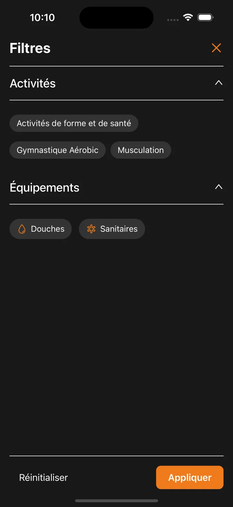

_Interface de filtrage par activités et équipements_

### Accès aux filtres

Les filtres sont accessibles via **le bouton filtres** présent sur :

-   **Page d'accueil & Carte interactive** : Juste à côté de la barre de recherche en haut de l'écran

> **💡 Avantage** : Les filtres sont **sauvegardés automatiquement** et s'appliquent à toutes vos recherches (textuelle et géographique).

### Options de filtrage disponibles

#### Filtrage par activités

**Section repliable "Activités"** (cliquez sur la flèche ↑ pour réduire/étendre) :

| Activité                           | Description                              |
| ---------------------------------- | ---------------------------------------- |
| **Activités de forme et de santé** | Cours wellness, remise en forme générale |
| **Gymnastique Aérobic**            | Cours collectifs, fitness cardio         |
| **Musculation**                    | Salles de musculation, haltérophilie     |

#### Filtrage par équipements

**Section repliable "Équipements"** :

| Équipement     | Icône | Importance                            |
| -------------- | ----- | ------------------------------------- |
| **Douches**    | 💧    | Vestiaires avec douches disponibles   |
| **Sanitaires** | 🚿    | Toilettes et installations sanitaires |

### Utilisation des filtres

#### Sélectionner des critères

1. **Ouvrez les filtres** via le bouton filtres à côté de la barre de recherche
2. **Développez les sections** "Activités" et "Équipements" si besoin
3. **Cliquez sur les badges** pour sélectionner/désélectionner :
    - **Badge activé** : Fond coloré (critère inclus dans la recherche)
    - **Badge inactif** : Fond gris (critère exclu)

#### Actions disponibles

-   **"Réinitialiser"** : Supprime tous les filtres sélectionnés
-   **"Appliquer"** : Active les filtres pour vos recherches
-   **Icône X** : Ferme la fenêtre de filtres

#### Persistance des filtres

-   **Sauvegarde automatique** : Vos filtres restent actifs entre les sessions
-   **Application universelle** : Les mêmes filtres s'appliquent sur l'accueil et la carte
-   **Recherche optimisée** : Seuls les établissements correspondant aux critères s'affichent

### Informations sur les établissements

Chaque établissement affiché présente :

**Informations principales :**

-   **Nom de l'établissement** (ex : Aériforme FITNESS)
-   **Adresse complète** avec code postal et ville
-   **Type d'activités proposées** (Gymnastique Aérobic, Musculation, etc.)

**Équipements disponibles :**

-   **Douches** ✅
-   **Sanitaires** ✅
-   (Autres équipements selon l'établissement)

**Actions possibles :**

-   **Icône cœur** : Ajouter/retirer des favoris
-   **"Voir plus de détails"** : Accéder à la page complète
-   **Localisation sur carte** : Voir l'emplacement exact

---

## Consultation des détails d'un établissement

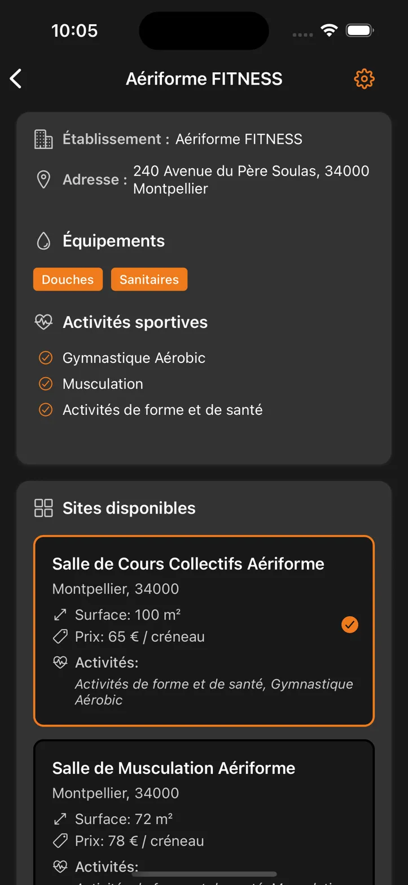

_Page de détail avec informations complètes et salles disponibles_

### Informations détaillées

La page de détail d'un établissement présente :

#### Informations générales

-   **Nom et type d'établissement**
-   **Adresse complète**
-   **Équipements disponibles** (Douches, Sanitaires, etc.)

#### Activités sportives proposées

Liste des disciplines disponibles avec des badges colorés :

-   **Gymnastique Aérobic**
-   **Musculation**
-   **Activités de forme et de santé**

#### Sites disponibles à la réservation

Chaque salle/espace est présenté dans une carte dédiée :

**Informations par salle :**

-   **Nom de la salle** (ex : "Salle de Cours Collectifs Aériforme")
-   **Localisation** (Ville, Code postal)
-   **Surface** en m² (ex : 100 m²)
-   **Prix** par créneau horaire (ex : 65 € / créneau)
-   **Activités spécifiques** disponibles dans cette salle

**Sélection de salle :**

-   **Bordure orange** : Indique la salle actuellement sélectionnée
-   **Coche orange** : Confirme la sélection
-   **Bouton de réservation** apparaît en bas pour la salle sélectionnée

> **💡 Important** : Si aucun site n'apparaît dans cette section, c'est que l'institution (complexe sportif) n'a pas encore défini de prix dans son profil. Dans ce cas, la réservation n'est pas possible pour le moment.

---

## Processus de réservation

### Sélection de la date et des horaires

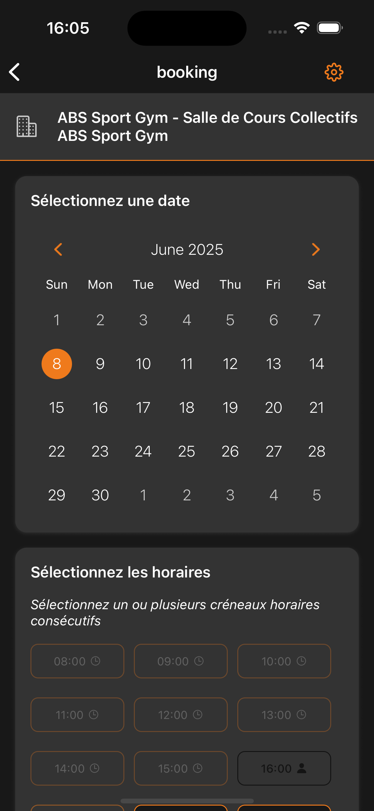

_Interface complète : calendrier de sélection de date et créneaux horaires_

#### Étape 1 : Sélection de la date

1. **Accédez au calendrier** depuis la page "booking"
2. **Naviguez entre les mois** avec les flèches < >
3. **Sélectionnez une date** (surlignée en orange)
    - Date actuelle mise en évidence
    - Dates disponibles en blanc
    - Date sélectionnée avec fond orange

#### Étape 2 : Choix de l'horaire

1. **Section "Sélectionnez les horaires"**
2. **Sélection multiple** : "Sélectionnez un ou plusieurs créneaux horaires consécutifs"
3. **États des créneaux** :
    - **Créneaux disponibles** : Fond gris, sélectionnables
    - **Créneaux sélectionnés** : Fond orange
    - **Icône horloge ⏰** : Créneau passé par rapport à l'heure actuelle
    - **Icône cadenas 🔒** : Déjà réservé par un autre coach
    - **Icône personnage 👤** : Déjà réservé par vous
4. **Navigation** :
    - **"Voir plus"** : Afficher d'autres créneaux horaires
    - **"Voir moins"** : Réduire l'affichage des créneaux
5. **Sélection multiple** : Vous pouvez sélectionner plusieurs créneaux consécutifs
6. **Compteur** : Le nombre de créneaux sélectionnés s'affiche automatiquement

#### Comprendre les icônes des créneaux

| Icône             | Signification              | Action possible       |
| ----------------- | -------------------------- | --------------------- |
| **Aucune icône**  | Créneau disponible         | ✅ Sélectionnable     |
| **⏰ Horloge**    | Créneau passé              | ❌ Non sélectionnable |
| **🔒 Cadenas**    | Réservé par un autre coach | ❌ Non sélectionnable |
| **👤 Personnage** | Déjà réservé par vous      | ℹ️ Informatif         |

### Étape 3 : Confirmation du prix

**Calcul automatique du prix :**

-   **"Prix calculé automatiquement"** : Montant total affiché en temps réel
-   **Détail du tarif** : Prix par créneau horaire (ex : "35 € par créneau horaire")
-   **Prix total** : Calculé selon le nombre de créneaux sélectionnés

> **💡 Note** : Le prix s'ajuste automatiquement selon le nombre de créneaux consécutifs sélectionnés.

### Étape 4 : Résumé de réservation

Vérifiez les informations avant confirmation :

| Élément          | Détail                                             |
| ---------------- | -------------------------------------------------- |
| **Date**         | Date sélectionnée (ex : samedi 7 juin 2025)        |
| **Horaires**     | Plage horaire des créneaux sélectionnés            |
| **Durée**        | Nombre d'heures total                              |
| **Installation** | Nom de l'établissement et salle                    |
| **Prix**         | Montant total (nombre de créneaux × prix unitaire) |

### Étape 5 : Finalisation

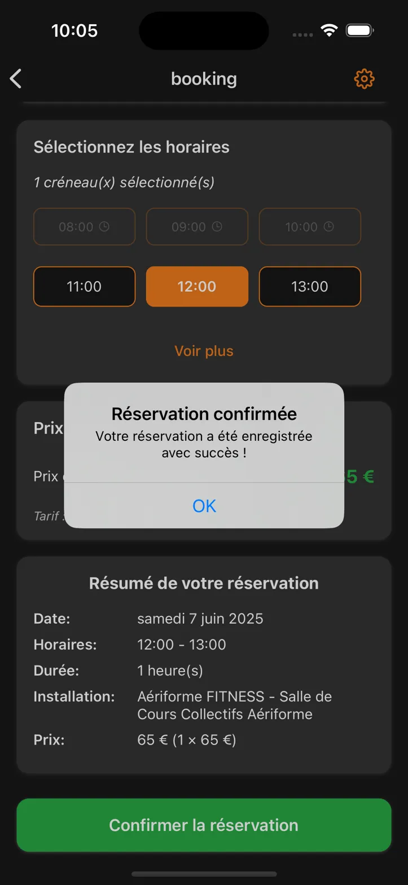

_Pop-up de confirmation après validation de la réservation_

1. **Cliquez sur "Confirmer la réservation"** (bouton vert)
2. **Pop-up de confirmation** apparaît :
    - "Réservation confirmée"
    - "Votre réservation a été enregistrée avec succès !"
3. **Cliquez sur "OK"** pour terminer

---

## Gestion des réservations Coach

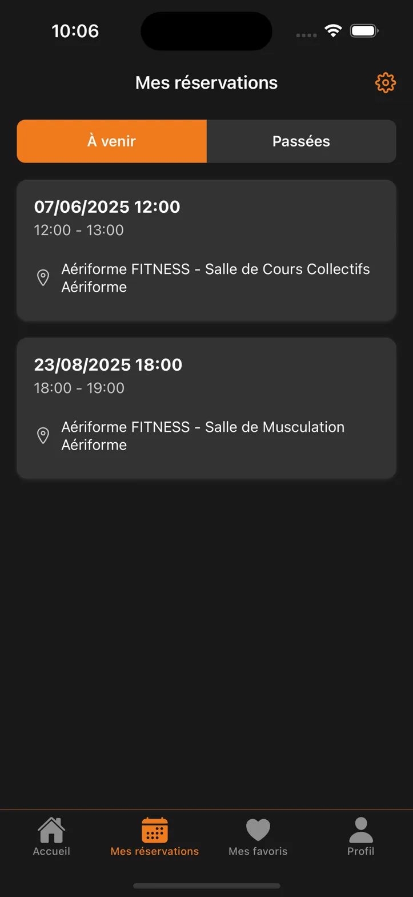

_Écran "Mes réservations" avec onglets "À venir" et "Passées"_

### Accès à vos réservations

Rendez-vous dans l'onglet **"Mes réservations"** depuis la navigation principale.

### Organisation des réservations

**Deux onglets disponibles :**

#### À venir (onglet orange actif)

Affiche toutes vos réservations futures avec :

-   **Date et heure** (format DD/MM/YYYY HH:MM)
-   **Durée du créneau** (ex : 12:00 - 13:00)
-   **Nom de l'établissement et salle**
-   **Icône de localisation** avec détails complets

#### Passées (onglet gris)

Historique de vos réservations terminées

### Informations détaillées par réservation

Chaque réservation affiche :

-   **Date complète** (ex : 07/06/2025 12:00)
-   **Plage horaire** (12:00 - 13:00)
-   **Établissement** : Aériforme FITNESS
-   **Salle spécifique** : Salle de Cours Collectifs Aériforme
-   **Localisation** avec icône de géolocalisation

---

## Gestion des favoris

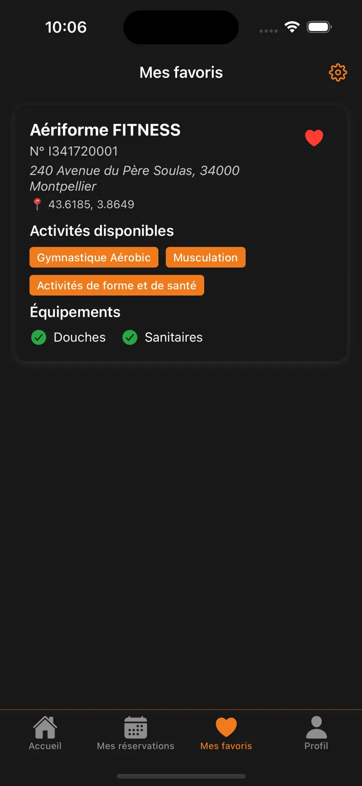

_Page "Mes favoris" avec établissement sauvegardé_

### Accès aux favoris

Rendez-vous dans l'onglet **"Mes favoris"** depuis la navigation principale.

### Ajouter un établissement aux favoris

1. **Depuis la page d'accueil** : Cliquez sur l'icône cœur ❤️ sur la carte d'établissement

### Informations des favoris

Chaque établissement favori affiche :

**Détails principaux :**

-   **Nom de l'établissement**
-   **Numéro d'identification** (ex : N° I341720001)
-   **Adresse complète**
-   **Coordonnées GPS** (latitude, longitude)

**Activités disponibles :**

-   **Badges orange** pour chaque activité (Gymnastique Aérobic, Musculation, etc.)

**Équipements :**

-   **Coches vertes** ✅ pour les équipements disponibles
-   **Douches** et **Sanitaires** confirmés

### Retirer des favoris

Cliquez à nouveau sur l'icône cœur ❤️ pour retirer l'établissement de vos favoris.

---

## Profil utilisateur Coach

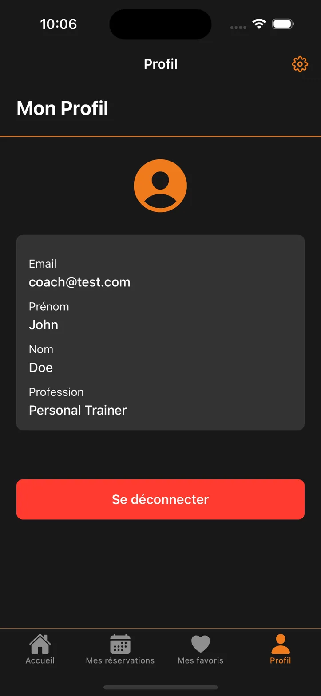

_Page profil avec informations personnelles et bouton de déconnexion_

### Accès au profil

Rendez-vous dans l'onglet **"Profil"** depuis la navigation principale.

### Informations personnelles

Votre profil affiche :

**Avatar utilisateur :**

-   **Icône de profil** orange par défaut
-   Zone pour photo de profil personnalisée

**Données personnelles :**

-   **Email** : Adresse email de connexion
-   **Prénom** : Votre prénom
-   **Nom** : Votre nom de famille
-   **Profession** : Votre spécialité professionnelle

### Déconnexion

Pour vous déconnecter :

1. **Cliquez sur "Se déconnecter"** (bouton rouge en bas)
2. Vous serez redirigé vers l'écran de connexion

> **⚠️ Important** : Assurez-vous de sauvegarder vos données importantes avant de vous déconnecter.

---

# PARCOURS INSTITUTION

## Inscription et connexion Institution

### Première utilisation - Inscription

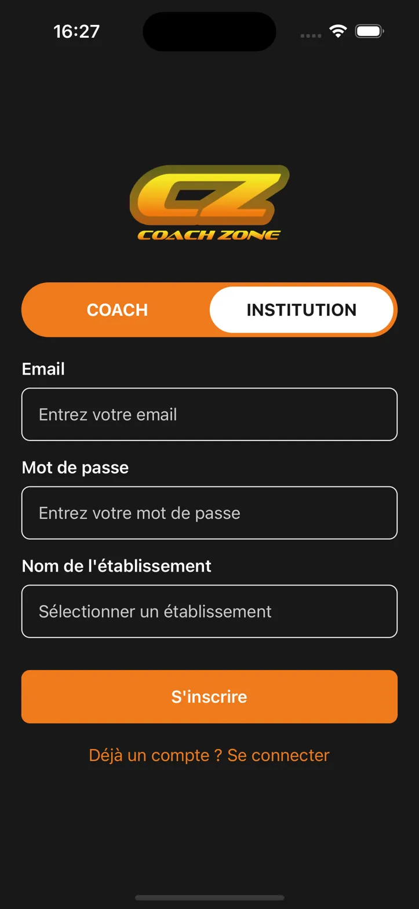

_Écran d'inscription avec sélection du type "INSTITUTION"_

Pour créer votre compte institution :

1. **Lancez l'application** Coach Zone
2. **Cliquez sur "Pas encore de compte ? S'inscrire"** depuis l'écran de connexion
3. **Sélectionnez "INSTITUTION"** dans le sélecteur de type d'utilisateur
4. **Remplissez le formulaire d'inscription** :
    - **Email** : Votre adresse email professionnelle
    - **Mot de passe** : Choisissez un mot de passe sécurisé
    - **Nom de l'établissement** : Cliquez sur "Sélectionner un établissement"

#### Sélection de votre établissement

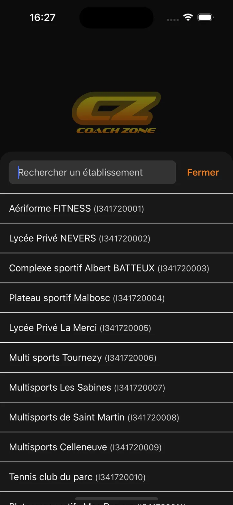

_Interface de recherche et sélection d'établissement_

Lorsque vous cliquez sur "Sélectionner un établissement", une fenêtre de recherche s'ouvre :

1. **Barre de recherche** : "Rechercher un établissement"
2. **Bouton "Fermer"** : Pour annuler la recherche
3. **Liste des établissements** disponibles avec :
    - **Nom de l'établissement**
    - **Code d'identification** entre parenthèses
    - Exemples : Aériforme FITNESS, Lycée Privé NEVERS, Complexe sportif Albert BATTEUX, etc.

**Pour sélectionner votre établissement :**

1. **Parcourez la liste** des établissements disponibles
2. **Cliquez sur votre établissement** pour le sélectionner
3. **L'établissement apparaît** dans le champ "Nom de l'établissement"

> **💡 Important** : Si votre établissement n'apparaît pas dans la liste, l'inscription n'est pas possible pour le moment. Cette fonctionnalité sera disponible dans une prochaine mise à jour.

5. **Cliquez sur "S'inscrire"** pour créer votre compte

### Connexion

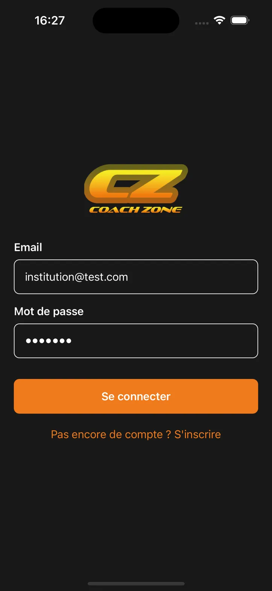

_Écran de connexion avec identifiants institution_

Si vous avez déjà un compte :

1. **Saisissez votre email** dans le champ "Email"
2. **Saisissez votre mot de passe** (affiché en points pour la sécurité)
3. **Cliquez sur "Se connecter"**

> **💡 Astuce** : Vos identifiants sont sauvegardés pour faciliter les connexions futures.

---

## Gestion des réservations Institution

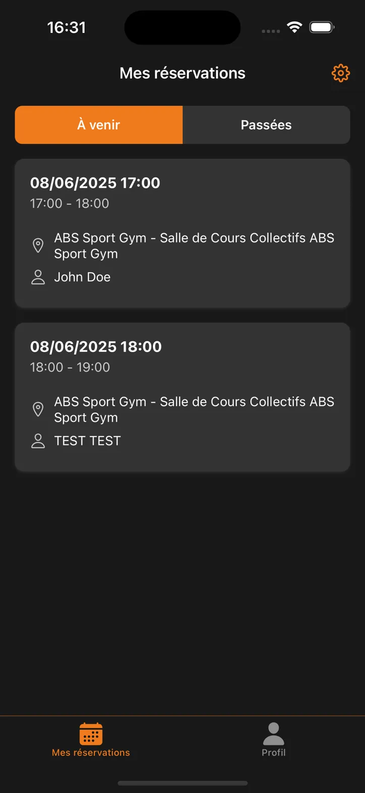

_Écran "Mes réservations" avec vue institution_

### Accès à vos réservations

Rendez-vous dans l'onglet **"Mes réservations"** depuis la navigation principale.

### Organisation des réservations

**Deux onglets disponibles :**

#### À venir (onglet orange actif)

Affiche toutes les réservations futures dans votre établissement avec :

-   **Date et heure** (format DD/MM/YYYY HH:MM)
-   **Durée du créneau** (ex : 17:00 - 18:00)
-   **Nom de l'établissement et salle**
-   **Nom du coach** qui a effectué la réservation (ex : John Doe, TEST TEST)
-   **Icône de localisation** avec détails complets

#### Passées (onglet gris)

Historique de toutes les réservations terminées

### Informations détaillées par réservation

Chaque réservation affiche :

-   **Date complète** (ex : 08/06/2025 17:00)
-   **Plage horaire** (17:00 - 18:00)
-   **Établissement** : Nom de votre complexe
-   **Salle spécifique** : Salle concernée par la réservation
-   **Coach réservant** : Nom du coach qui a effectué la réservation
-   **Localisation** avec icône de géolocalisation

---

## Profil et gestion des prix

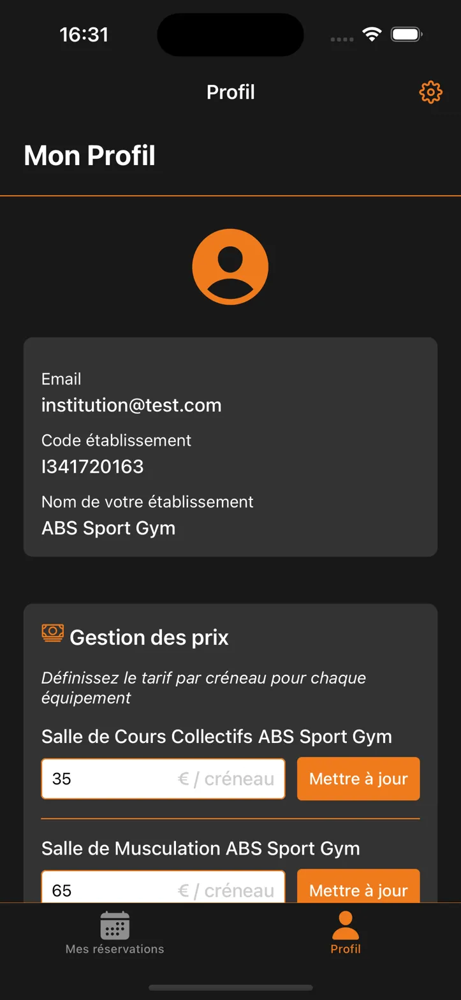

_Page profil avec informations et gestion des tarifs_

### Accès au profil

Rendez-vous dans l'onglet **"Profil"** depuis la navigation principale.

### Informations de l'établissement

Votre profil affiche :

**Avatar institution :**

-   **Icône de profil** orange par défaut
-   Zone pour logo de l'établissement

**Données de l'établissement :**

-   **Email** : Adresse email de connexion
-   **Code établissement** : Identifiant unique (ex : I341720163)
-   **Nom de votre établissement** : Nom officiel (ex : ABS Sport Gym)

### Gestion des prix

**Section cruciale pour les réservations :**

#### Principe de fonctionnement

-   **"Définissez le tarif par créneau pour chaque équipement"**
-   **Tarification par salle** : Chaque espace a son propre tarif
-   **Prix par créneau horaire** : Tarif défini pour chaque heure de réservation

#### Configuration des tarifs

**Pour chaque salle/équipement :**

| Élément                    | Description                                    | Action                |
| -------------------------- | ---------------------------------------------- | --------------------- |
| **Nom de la salle**        | Ex : "Salle de Cours Collectifs ABS Sport Gym" | Informatif            |
| **Champ de prix**          | Zone de saisie du montant                      | Saisissez le prix     |
| **Unité**                  | "€ / créneau"                                  | Automatique           |
| **Bouton "Mettre à jour"** | Validation du nouveau tarif                    | Clic pour sauvegarder |

**Exemples de configuration :**

-   **Salle de Cours Collectifs** : 35 € / créneau
-   **Salle de Musculation** : 65 € / créneau

#### Importance de la configuration des prix

> **🚨 Essentiel** : Si vous ne définissez pas de prix pour vos salles, elles n'apparaîtront pas dans la section "Sites disponibles" pour les coachs et ne pourront pas être réservées.

**Étapes pour activer les réservations :**

1. **Saisissez un prix** dans le champ de chaque salle
2. **Cliquez sur "Mettre à jour"** pour chaque tarif
3. **Vos salles deviennent réservables** par les coachs
4. **Les coachs voient vos tarifs** lors de leurs réservations

### Déconnexion

Pour vous déconnecter :

1. **Cliquez sur "Se déconnecter"** (bouton rouge en bas)
2. Vous serez redirigé vers l'écran de connexion

> **⚠️ Important** : Assurez-vous que tous vos tarifs sont configurés avant de vous déconnecter.

---

# FONCTIONNALITÉS COMMUNES

## Paramètres de l'application

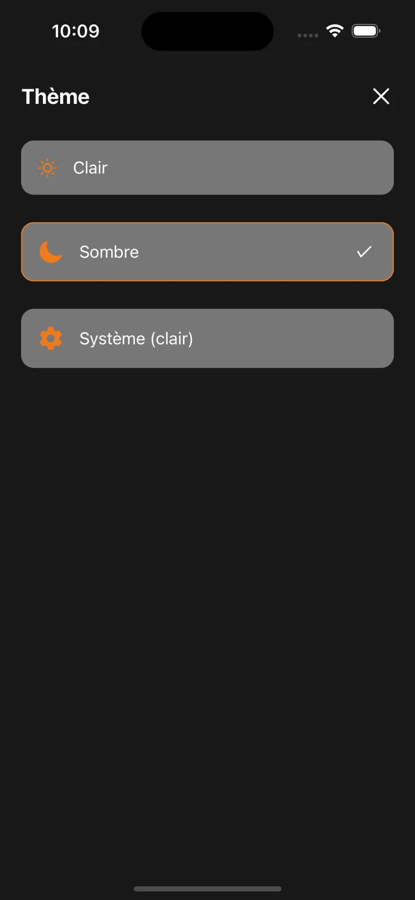

_Interface de sélection des thèmes (Clair, Sombre, Système)_

### Accès aux paramètres

L'icône **paramètres (⚙️)** est disponible en haut à droite de chaque écran et permet d'accéder aux **options de personnalisation du thème**.

### Gestion des thèmes

L'application propose **3 modes d'affichage** pour s'adapter à vos préférences :

#### Options de thème disponibles

| Thème               | Icône | Description                                           |
| ------------------- | ----- | ----------------------------------------------------- |
| **Clair**           | ☀️    | Interface avec fond blanc et texte sombre             |
| **Sombre**          | 🌙    | Interface avec fond noir et texte clair (par défaut)  |
| **Système (clair)** | ⚙️    | Suit automatiquement les paramètres de votre appareil |

#### Changer de thème

1. **Cliquez sur l'icône paramètres (⚙️)** depuis n'importe quel écran
2. **Sélectionnez le thème souhaité** :
    - Le thème actuel est **souligné en orange** avec une **coche de validation**
    - Cliquez sur un autre thème pour le sélectionner
3. **Fermez la fenêtre** avec le **X** en haut à droite
4. **Le changement est immédiat** et s'applique à toute l'application

> **💡 Note** : Le thème **Sombre** est activé par défaut pour un confort visuel optimal.

---

## Conseils d'utilisation

### Pour les coachs

1. **Configurez vos filtres préférés** dès la première utilisation pour des recherches ciblées
2. **Ajoutez vos établissements préférés en favoris** pour un accès rapide
3. **Planifiez vos réservations à l'avance** pour garantir la disponibilité
4. **Consultez régulièrement vos réservations** pour éviter les oublis
5. **Utilisez la recherche géographique** pour découvrir de nouveaux espaces
6. **Vérifiez les équipements disponibles** avant de réserver
7. **Combinez filtres textuels et géographiques** pour une recherche précise

### Pour les institutions

1. **Configurez immédiatement vos tarifs** pour rendre vos espaces réservables
2. **Vérifiez régulièrement les réservations** pour anticiper l'affluence
3. **Adaptez vos prix** selon la demande et les créneaux
4. **Surveillez l'occupation** de vos différentes salles
5. **Maintenez vos tarifs à jour** pour refléter votre politique tarifaire

### Points d'attention importants

-   **Sans prix configurés** = **Pas de réservations possibles** (Institutions)
-   **Chaque salle** doit avoir son tarif défini individuellement (Institutions)
-   **Les modifications de prix** sont immédiates pour les nouvelles réservations (Institutions)
-   **Consultez régulièrement** les réservations pour optimiser vos espaces (Institutions)

---

_Cette documentation couvre l'ensemble des parcours utilisateurs pour l'application Coach Zone._
